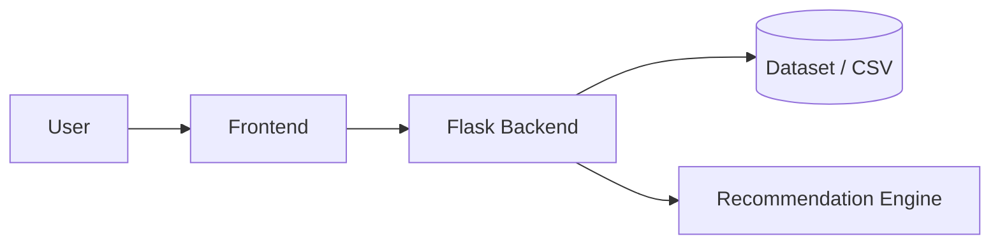
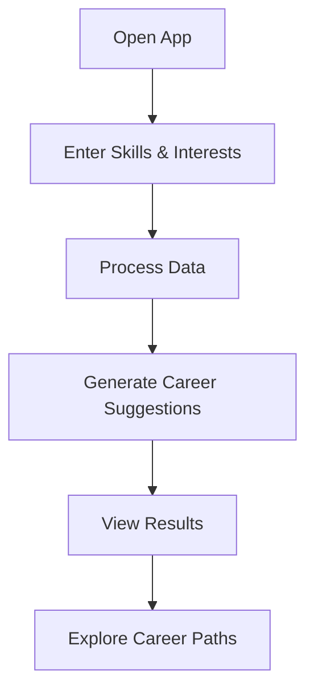

# CareerSpace

🚀 **AI-powered career guidance platform for smarter future decisions**

CareerSpace is a web-based application that helps students and job seekers discover the most suitable career paths based on their skills, interests, and preferences. It simplifies complex decision-making using intelligent recommendations and data-driven insights.


---

## 📌 Table of Contents

* [🚀 Hero Section](#-hero-section)
* [📖 About the Project](#-about-the-project)
* [🧰 Tech Stack](#-tech-stack)
* [🏗️ System Architecture](#-system-architecture)
* [🔄 Workflow / Flowchart](#-workflow--flowchart)
* [⚙️ Installation](#-installation)
* [🚀 Usage](#-usage)
* [🗂️ Folder Structure](#-folder-structure)
* [🖼️ Screenshots / Demo](#-screenshots--demo)
* [📊 Future Improvements](#-future-improvements)
* [🌍 Applications / Use Cases](#-applications--use-cases)
* [🤝 Contributing](#-contributing)
* [📄 License](#-license)

---

## 🚀 Hero Section

**CareerSpace** is an **AI-powered career recommendation system**. It helps **students and job seekers** by **analyzing their skills and interests to suggest the most suitable career paths**.

---

## 📖 About the Project

**Problem Statement:**
Many students struggle to choose the right career due to lack of guidance, clarity, and personalized recommendations.

**Solution:**
CareerSpace provides an intelligent system that evaluates user input (skills, interests, preferences) and suggests relevant career paths using structured logic and data.

**Target Users:**

* Students (school & college)
* Fresh graduates
* Career switchers

**Real-world Use Case:**
A college student unsure about future options can input their skills (e.g., coding, design, communication), and CareerSpace will suggest roles like Software Developer, UI/UX Designer, or Data Analyst.

---

## 🧰 Tech Stack

* **Frontend:** HTML, CSS, JavaScript
* **Backend:** Python (Flask)
* **Database:** CSV / Dataset-based storage
* **Tools:** Git, GitHub, VS Code

**Architecture Type:** Monolithic

**Deployment Platform:** Local (can be extended to cloud like AWS / Render)

---

## 🏗️ System Architecture



---

## 🔄 Workflow / Flowchart



---

## ⚙️ Installation

1. **Clone the repository**

   ```bash
   git clone <your-repo-url>
   cd CareerSpace
   ```
2. **Install dependencies**

   ```bash
   pip install -r requirements.txt
   ```
3. **Run the project**

   ```bash
   python app.py
   ```

---

## 🚀 Usage

1. Open the application in your browser
2. Enter your skills and interests
3. Submit the form
4. View recommended career options
5. Explore and analyze suggested paths

---

## 🗂️ Folder Structure

```text
CareerSpace/
├── app.py
├── templates/
├── static/
├── utils/
├── dataset/
└── README.md
```


## 📊 Future Improvements

* 🤖 Integrate advanced AI/ML models for better predictions
* 📈 Personalized career roadmap generation
* 🌐 Multi-language support
* 🔐 User login & profile system
* 📊 Dashboard with analytics and insights

---

## 🌍 Applications / Use Cases

* 🎓 University career guidance systems
* 💼 Job portals and recruitment platforms
* 🧑‍💻 Students exploring career options
* 🏢 HR tools for candidate guidance

---

## 🤝 Contributing

Contributions are welcome!

1. Fork the repository
2. Create a new branch: `git checkout -b feature/your-feature`
3. Commit your changes: `git commit -m "Add your feature"`
4. Push to the branch: `git push origin feature/your-feature`
5. Open a Pull Request

---

## 📄 License

This project is licensed under the MIT License.
